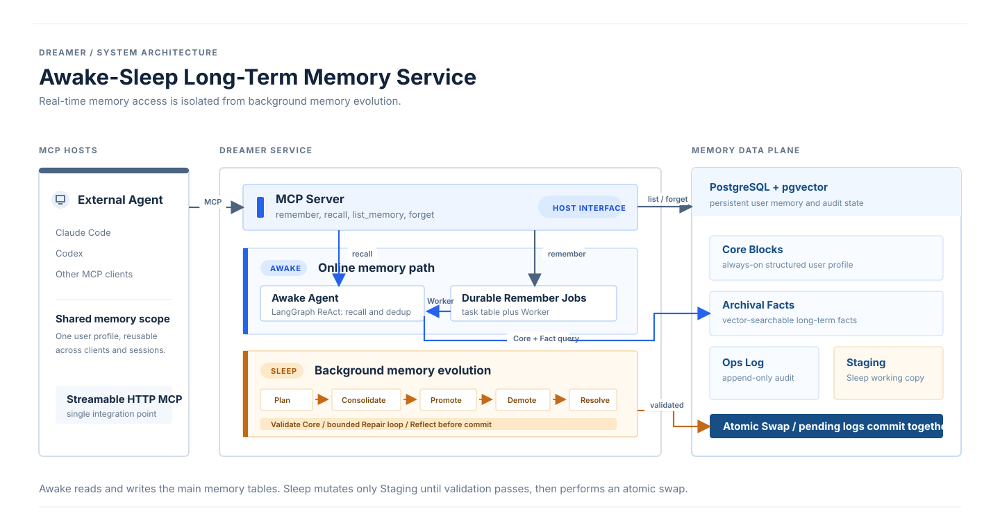

# Dreamer

> A long-term memory service for external AI agents, built around an Awake-Sleep architecture inspired by human memory consolidation.

[](https://github.com/1yuxiangJ/Dreamer/actions/workflows/ci.yml)
[](https://www.python.org/)
[](LICENSE)

Dreamer gives MCP-compatible agents a shared, persistent memory layer for facts about a user: preferences, habits, goals, skills, and stable context that should survive across sessions and host clients.

It separates the latency-sensitive online path from background memory maintenance:

- **Awake** handles semantic Remember and Recall requests through a LangGraph ReAct loop.
- **Sleep** runs during configured idle windows, consolidating fragmented memories, promoting useful facts into Core, demoting stale low-value facts, resolving Core conflicts, and validating Core changes before commit.
- **PostgreSQL + pgvector** stores vector-searchable facts, structured Core blocks, durable write jobs, and append-only audit logs.

## Why this project

Most coding agents keep memory inside a single client or project. Dreamer treats long-term memory as an independent service:

- one user memory space can be consumed by multiple MCP hosts;
- the host-facing path stays responsive while slow semantic writes run asynchronously;
- background maintenance evolves memory without exposing half-finished state to online reads;
- every committed change remains traceable through an audit log.

Current host verification is with Claude Code. Any host supporting streamable HTTP MCP can use the same API and database.

## Architecture



### Awake: online memory decisions

| Request | Execution path |
|---|---|
| `remember` | Persist an intent in `memory_write_jobs`, return quickly, then let a Worker run Awake's ReAct loop for semantic deduplication and Fact insertion. |
| `recall` | Awake loads relevant Core context and vector-searches Archival Facts. Only Fact IDs selected in the final Recall result increase `use_count`. |
| `list_memory` | Deterministic direct database read. |
| `forget` | Deterministic, idempotent soft delete by Fact ID in one database transaction. |

### Sleep: background memory evolution

Sleep is a LangGraph `StateGraph` with a small conditional repair loop:

```text
Snapshot → Plan → Consolidate → Promote → Demote → Resolve
                                                 ↓
                                      Validate Core
                                       ├─ PASS → Reflect → Atomic Swap
                                       ├─ REPAIRABLE → Repair → Validate
                                       └─ FATAL / timeout → Abort + cleanup
```

Sleep copies main tables into Staging first. It changes only Staging while Awake continues to access main tables. Before commit, it briefly acquires the required table lock, merges Awake-side usage and soft-delete fields, incorporates newly inserted Facts, then atomically swaps the table names and writes pending audit logs in the same transaction.

## Quick start

The recommended path uses Docker Compose for PostgreSQL + pgvector. You still need API keys for the chat model and embedding model.

```bash
git clone https://github.com/1yuxiangJ/Dreamer.git
cd Dreamer
cp .env.example .env
# Edit .env: set DEEPSEEK_API_KEY and EMBED_API_KEY
docker compose up --build
```

Check the service:

```bash
curl http://127.0.0.1:8000/health
```

Then add the MCP endpoint to your host:

```json
{
  "mcpServers": {
    "dreamer": {
      "type": "http",
      "url": "http://127.0.0.1:8000/mcp"
    }
  }
}
```

For Claude Code:

```bash
claude mcp add --transport http dreamer --scope user http://127.0.0.1:8000/mcp
```

See [docs/QUICKSTART.md](docs/QUICKSTART.md) for native setup, configuration, and verification.

## Development

```bash
uv sync --all-extras
uv run ruff check src tests scripts
uv run mypy src
uv run pytest
```

PostgreSQL integration tests require a local `dreamer_test` database with pgvector:

```bash
DATABASE_URL_TEST=postgresql+asyncpg://USER@localhost:5432/dreamer_test \
uv run pytest --run-integration
```

## Scope and current limits

- Single-user, localhost-first service; there is no authentication or tenant isolation yet.
- The scheduler is configurable and disabled by default. Set `SLEEP_SCHEDULER_ENABLED=true` to enable idle and daily triggers.
- Dreamer is Letta-inspired, not a fork or a production replacement for Letta.
- The public project includes implementation and tests; private study notes, construction logs, and offline evaluation artifacts are intentionally excluded.

## Stack

Python 3.11+, FastAPI/Starlette, MCP, LangGraph, SQLAlchemy async, PostgreSQL, pgvector, APScheduler, Docker Compose, Ruff, mypy, and pytest.

## License

MIT. See [LICENSE](LICENSE).
